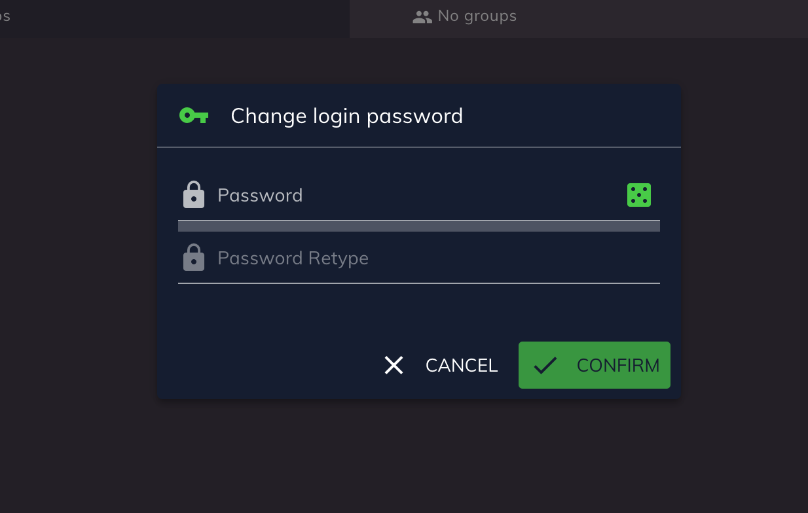

# Customer Self-Care Web UI

## Development Quick Start for internal developers

* Check if [internal development server](https://dev-web-trunk.mgm.sipwise.com/) is running
* Clone GIT repo ngcp-csc-ui

    `git clone ssh://hostname:port/ngcp-csc-ui`

* [Install Docker](https://docs.docker.com/get-docker)
* [Install yarn](https://yarnpkg.com/getting-started/install)

### Run development environment in Docker

This is the preferred way to work with.
If you have any problems with Docker,
you can fallback to the method described
in the next chapter.

```shell script
yarn run dev:docker dev-web-trunk.mgm.sipwise.com
```

### Run development environment in your system of choice

```shell script
yarn run config dev-web-trunk.mgm.sipwise.com
yarn run dev
```

## Technology

### Vue.js and Quasar

After a test phase with Sencha Ext JS we decided to use
[Vue.js](https://vuejs.org) in combination with the [Quasar Framework](https://quasar.dev).

### Developers basics

We highly recommend the following courses to understand the
principles and ultimately the code:

* [Intro to Vue 2](https://www.vuemastery.com/courses/intro-to-vue-js/vue-instance)
* [Real World Vue 2](https://www.vuemastery.com/courses/real-world-vue-js/real-world-intro)
* [Mastering Vuex](https://www.vuemastery.com/courses/mastering-vuex/success-error-notifications)

In addition, we also recommend the following Quasar Framework tutorials:

* [Quasar Video Tutorials](https://quasar.dev/video-tutorials)

## Project Guide

* [Reusable Vue.js Components](doc/COMPONENTS.md)

### Translations
To keep translation files consistent and updated please run **i18n:extract** command before each commit to the GIT repo.

    yarn run i18n:extract

That CLI command will collect all new translation keys from the JS source code, and will place those keys into all translation files in a proper format.

Example of the JS code with translations:

```javascript
const someOptions = {
    label: this.$t('Remove message'),
    message: this.$t('The {email} will be removed. Are you sure?', { email: this.email })
}
```
**Important**: We are trying to avoid usage of the dynamic keys (example below) because it's very difficult to detect and collect automatically.

Example (anti-pattern):
```javascript
function getTranslatedMessage (weatherState) {
    return this.$t('Tooday is ' + weatherState)
}
```
Try to avoid such code and use text messages with substitution variables (like `email` in example above) or if there are only a couple similar messages, you can use a map object to convert some exact state to exact translation message.
But if it's really impossible to do, and you have to use dynamic keys, you should place such keys to the English translation file manually and execute `i18n:extract` which will do all the rest.

For example, for the code above, you would need to place next lines into `en.json`:
```JSON
{
    ...
    "Today is sunny": "",
    "Today is windy": "",
    "Today is cloudy": ""
}
```

**Note**: if you want to see information about missed or possible unused translation keys you could run **i18n:extract-report** command. It will just display detailed report without any modifications in the language files.

Keep in mind that some of "Unused translations" keys might be dynamic translation keys which cannot be detected in source code automatically and were added manually.

    yarn run i18n:extract-report


### Add a new page

In order to add a new page you need to go along the following steps:

* Create a new page component using the following naming pattern

    `src/pages/CscPageNewFeature.vue`

* Create a route and add it to the route file

    `src/router/routes.js`

```javascript
{
    path: '/user/new-feature',
    component: CscPageNewFeature,
    meta: {
        title: i18n.t('New features'),
        subtitle: i18n.t('New features sub-title')
    }
}
```

* Add new feature to the main menu

    `src/components/CscMainMenuTop.vue`

```javascript
{
    to: '/user/new-feature',
    icon: 'fancy_icon',
    label: this.$t('New features'),
    sublabel: this.$t('New features sub-title'),
    visible: true
}
```

### Dialogs



The basic dialog component is `src/components/CscDialog.vue`.

#### How to create a new custom dialog

Check the example implementation in `src/components/CscDialogChangePassword.vue`.

#### How to call custom dialogs from within a Vue.js Component method

To reduce the boilerplate code of dialog components, we call Dialogs
via [Quasar Dialog Plugin](https://quasar.dev/quasar-plugins/dialog).

```javascript
this.$q.dialog({
    component: CscDialogChangePassword,
    parent: this
}).onOk((password) => {
    this.changeWebPassword(password)
})
```

### NGCP API

All API functions are located in `src/api`. The file `src/api/common.js`
exports basic convenient functions to perform API requests.

Check [API Documentation](https://dev-web-trunk.mgm.sipwise.com:1443/api) for further details.

### Authentication

The standard authentication method to access the API from the browser is the [JSON Web Token (JWT)](https://jwt.io) which is specified in [RFC7519](https://tools.ietf.org/html/rfc7519)

After the login request, the JWT is stored in the LocalStorage and is added automatically on each API request.

#### Fetch a list of items

```javascript
const list = await getList({
    resource: 'subscribers'
})
list.items.forEach(subscriber => {
    console.log(subscriber.webusername)
})
```

#### Fetch a paginated list of items

```javascript
const list = await getList({
    resource: 'subscribers',
    page: 1,
    rows: 25
})
console.log(list.lastPage)
```

#### Fetch a single item
```javascript
const subscriber = await get({
    resource: 'subscribers',
    resourceId: 21
})
console.log(subscriber.webusername)
```

#### Create a new item

If you use `post`, you create the
item and get back the sanitised data.
The method `postMinimal` does exactly
the same, except that the body is empty.

```javascript
const subscriber = await post({
    resource: 'subscribers',
    body: {
        webusername: 'alice',
        ...
    }
})
console.log(subscriber.webusername)
```
```javascript
await postMinimal({
    resource: 'subscribers',
    body: {
        webusername: 'alice',
        ...
    }
})
```

#### Update an existing item

This method helps to update an entire item at once.

```javascript
const subscriber = await put({
    resource: 'subscribers',
    resourceId: 21,
    body: {
        webusername: 'bob',
        ...
    }
})
console.log(subscriber.webusername)
```
```javascript
await putMinimal({
    resource: 'subscribers',
    resourceId: 21,
    body: {
        webusername: 'bob',
        ...
    }
})
```

#### Update a specific field on an existing item

This is the preferred method to update single fields on an item.

```javascript
await patchReplace({
    resource: 'subscribers',
    resourceId: 21,
    fieldPath: 'webusername',
    value: 'carol'
})
```
```javascript
const subscriber = await patchReplaceFull({
    resource: 'subscribers',
    resourceId: 21,
    fieldPath: 'webusername',
    value: 'dave'
})
console.log(subscriber.webusername)
